<h2> Hi, I'm Alienegra! </h2>

[//]: # ( )

[//]: # (![AlienegraGeek Github Stats]&#40;https://github-readme-stats.vercel.app/api?username=AlienegraGeek&count_private=true&show_icons=true&title_color=fff&icon_color=79ff97&text_color=9f9f9f&bg_color=0D1117&border_color=0d1117&show_owner=true&rank_icon=github&#41;)

[//]: # ()

[//]: # (

)

  
  

